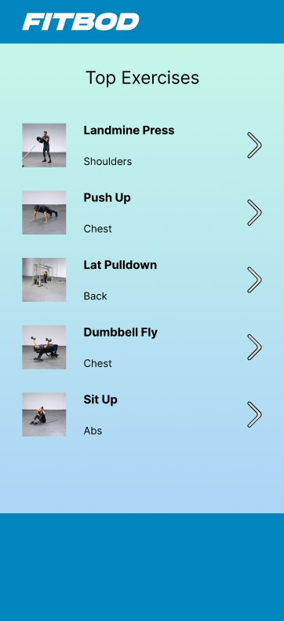
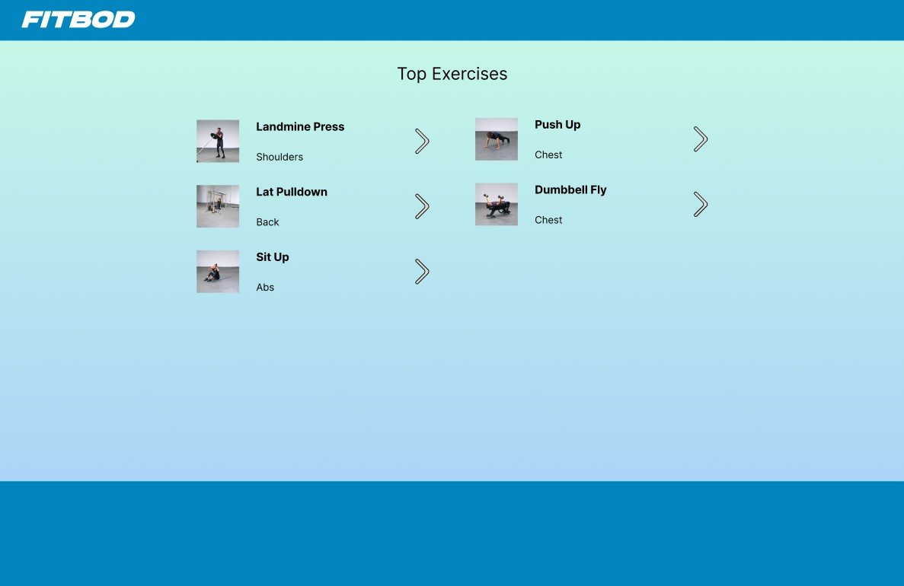
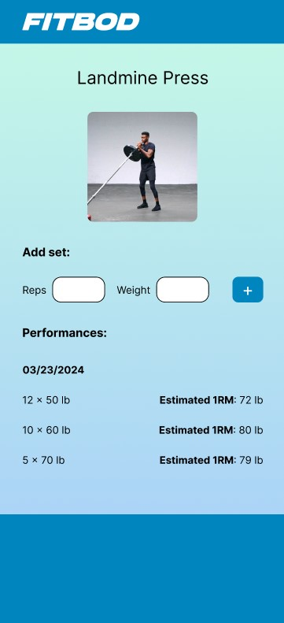
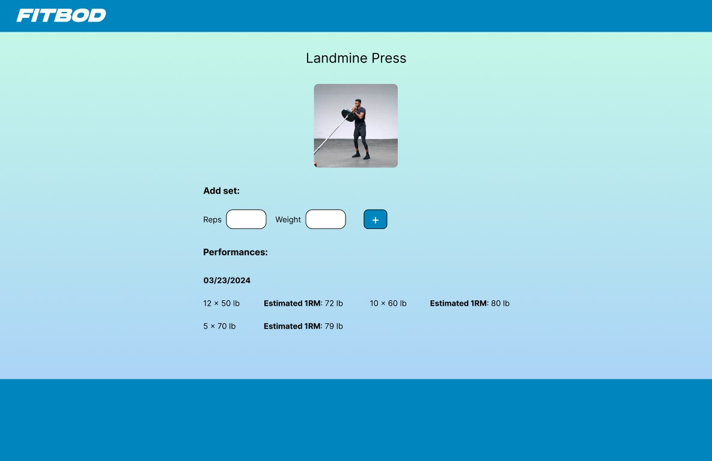

<div id="top"></div>

<div align="center">

# Fitbod Technical Assignment

I developed a User Exercise Plan Board with integrated Performance List Management functionalities, utilizing Next.js 14 and TypeScript. The solution was crafted in accordance with the specified requirements. Please feel free to reach out to me via [dustin.jason.lee@gmail.com][email].

[Source Code][solution-url] . [Live Page][live-page]

</div>

<details>
<summary>Table of contents</summary>

- [Technologies](#technologies)
- [Features](#features)
- [Screenshots](#screenshots)
- [How to Run](#how-to-run)
- [Contact](#contact)

</details>

## Overview

### Technologies

- [Next.js 14.1](https://nextjs.org) for SSR and SSG implementation.
- [React 18.x](https://react.dev) for building the UI by optimizing the rendering process.
- [TypeScript](https://www.typescriptlang.org) as a primary programming language.
- [Styled Components](https://styled-components.com) for component-level styling.
- [Axios](https://axios-http.com/docs/intro) for API data fetching and integration.
- [ESLint](https://eslint.org) to enforce coding standards and practices.
- [Husky](https://typicode.github.io/husky) to automate code checks before commits, preventing errors.

### Screenshots

<table>
  <tr>
    <td>
      
    </td>
		<td>
      
    </td>
  </tr>
  
  <tr>
	  <td>
      
    </td>
		<td>
      
    </td>
  </tr>
</table>

<p align="right"><a href="#top">⬆️ Back to top</a></p>

### Features

- Showcase of Loading spin component while fetching data from the API.
- Showcase of Error message when data fetch is failed.
- Fully Responsive Design for web, tablet and mobile devices.
- Navigation to dynamic routes by clicking items on the homepage.
- Add a performance item by entering reps and weight inputed by the user.
- Store the list to localStorage to make sure the data to be persisted.

### How to Run

1. Create an .env file to the root project and paste `GOOGLE_API` variable.

```bash
GOOGLE_API=https://storage.googleapis.com/fitbod-web-internal/exercises.json
```

2. Install required dependencies:

```bash
npm install
```

3. Run the development server:

```bash
npm run dev
```

4. Open [http://localhost:3000](http://localhost:3000) with your browser to see the result.

<p align="right"><a href="#top">⬆️ Back to top</a></p>

### Contact

Thank you for considering my proposed solution. I would greatly appreciate any feedback or evaluation you could provide. Should you have any comments or require further information, please do not hesitate to contact me at [dustin.jason.lee@gmail.com][email].

Looking forward to your response!

<p align="right"><a href="#top">⬆️ Back to top</a></p>

[live-page]: https://space-tourist.vercel.app
[solution-url]: https://www.frontendmentor.io/solutions/space-tourism-solution-in-nextjs-OMUOrt3m__
[email]: mailto:dustin.jason.lee@gmail.com
